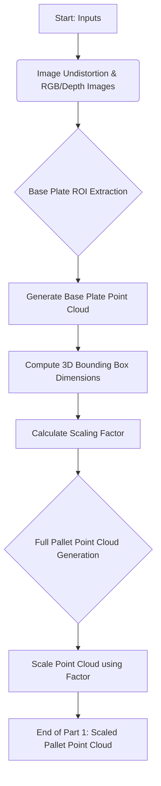
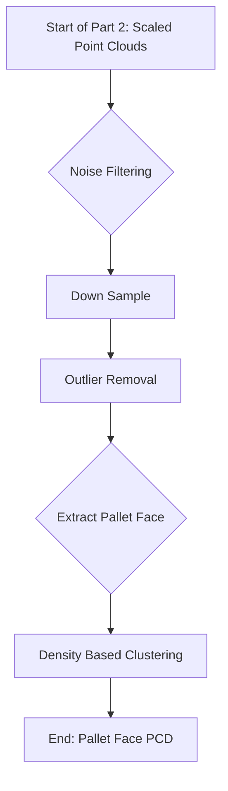

# **3D Volume Pipeline: Cargo Pallet Volume Estimation** 📦

This document provides a technical overview of a 3D volume pipeline designed to accurately estimate the volume of cargo pallets. The system utilizes four asynchronous cameras—left, right, front, and back—to capture multi-view images of a pallet moving through a defined space. The primary challenge addressed is the **scale variance** in the 3D point clouds generated from these asynchronous captures. The pipeline leverages a robust methodology to correct this scaling issue and ensure accurate volume measurement.

---

## **1. Project Overview**

This project aims to solve the problem of accurately measuring the volume of cargo pallets in an automated system. The key technical challenge is the **asynchronous data capture**, which leads to different scales for each 3D point cloud generated from the four cameras. Our solution involves a series of steps to first correct the scale and then reconstruct the 3D geometry of the pallet for volume calculation.

---

## **2. Pipeline Inputs**

The pipeline requires the following inputs for each camera view:

* **Intrinsic Parameters:** Camera calibration matrix (focal lengths, principal point).
* **Extrinsic Parameters:** Camera pose (rotation and translation relative to a world coordinate system).
* **RGB Image:** The raw color image of the pallet.
* **Pallet Bounding Box:** A 2D bounding box indicating the location of the pallet in the RGB image.
* **Base Plate ROI (Region of Interest):** A 2D region defining the pallet's base plate.

---

## **3. Pipeline Workflow**

The pipeline is a multi-stage process that combines modern deep learning models with classic computer vision techniques. The core steps are as follows:

### **3.1. Image Preprocessing**
* **Image Undistortion:** The input **RGB image** is first corrected for lens distortions using the camera's intrinsic parameters. This step is crucial for maintaining geometric accuracy, as it ensures straight lines in the real world appear as straight lines in the image.

### **3.2. Monocular Depth Estimation**

* **Depth Anything V2 Metric Small:** This deep learning model is used to generate a **metric depth map** from the undistorted RGB image. This map provides a dense per-pixel depth value, which is essential for converting 2D pixel coordinates into 3D space.

### **3.3. Pallet Segmentation**

* **SAM (Segment Anything) V2:** The pallet is precisely segmented from the background using the **SAMv2 small/large** model. By providing the undistorted RGB image and the **pallet bounding box**, the model generates a highly accurate binary mask. This mask is then applied to the depth image to obtain a "segmented depth map," containing only the depth information relevant to the pallet.

### **3.4. Scale Calculation and 3D Reconstruction**

This is the most critical stage, where we solve the **scale variance issue** by using the pallet's base plate as a reference.

#### **3.4.1. Calculating the Scaling Factor**

1.  **Base Plate Point Cloud Generation:** Using the pre-defined **base plate ROI**, we extract the depth and color information of the base plate from the segmented depth and RGB images. These points are then converted into a 3D point cloud using the camera's intrinsic parameters. The conversion from a 2D pixel coordinate $(u, v)$ to a 3D coordinate $(X_c, Y_c, Z_c)$ in the camera's frame is given by:
    

    $$
    Z_c = \text{depth}(u, v)
    $$

    $$
    X_c = (u - c_x) * Z_c / f_x
    $$

    $$
    Y_c = (v - c_y) * Z_c / f_y
    $$

    where $(c_x, c_y)$ are the principal point coordinates and $(f_x, f_y)$ are the focal lengths.

2.  **3D Dimension Calculation:** An oriented bounding box (OBB) is computed for the 3D base plate point cloud. The dimensions of this OBB provide the calculated width and length of the base plate in the 3D domain.

3.  **Deriving the Scaling Factor:** The scaling factor is calculated by comparing the known, real-world dimensions of the base plate to the dimensions calculated in the 3D domain.

    $$
    \text{Scaling Factor} = \frac{\text{Known Real-World Dimension}}{\text{Calculated 3D Dimension}}
    $$

    This factor is specific to each camera view and corrects the scale of the subsequent point cloud.

#### **3.4.2. Scaling the Full Pallet Point Cloud**

1.  **Full Pallet Point Cloud Generation:** A 3D point cloud of the entire pallet is created from the segmented depth map using the same 2D-to-3D conversion formulas.

2.  **Scaling:** All points in the newly generated pallet point cloud are multiplied by the scaling factor derived in the previous step. This ensures that the 3D point cloud is metrically accurate and can be used for reliable volume calculation.

### **3.5. Pallet face Point Cloud Extraction**

---

## **4. Technical Stack**

| Component | Technology / Library | Role |
| :--- | :--- | :--- |
| **Deep Learning Models** | Depth Anything V2, SAMv2 | Depth Estimation, Semantic Segmentation |
| **3D Processing** | Open3D, PCL | Point cloud generation, transformations, bounding box computation |
| **Core Language** | Python | Main scripting and integration |
| **Inference Engine** | PyTorch, TensorFlow | For running deep learning models |
